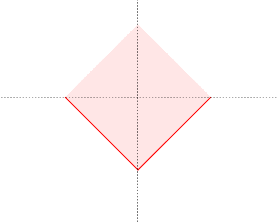

## CSS3箭头

#### 90°直角箭头
原理： 看做只有两个边框的元素，再旋转45°


``` css
.arrow-90 {
    width: 20px;
    height: 20px;
    border-top: 2px solid #000;
    border-right: 2px solid #000;
    transform: rotate(45deg);
}
```

### 非90°箭头
在90°箭头的基础上，利用skew在X轴或者Y轴进行扭曲变形。
``` css
.arrow {
    width: 20px;
    height: 20px;
    border-top: 2px solid #000;
    border-right: 2px solid #000;
    transform: rotate(55deg) skewX(30deg);
}
```

